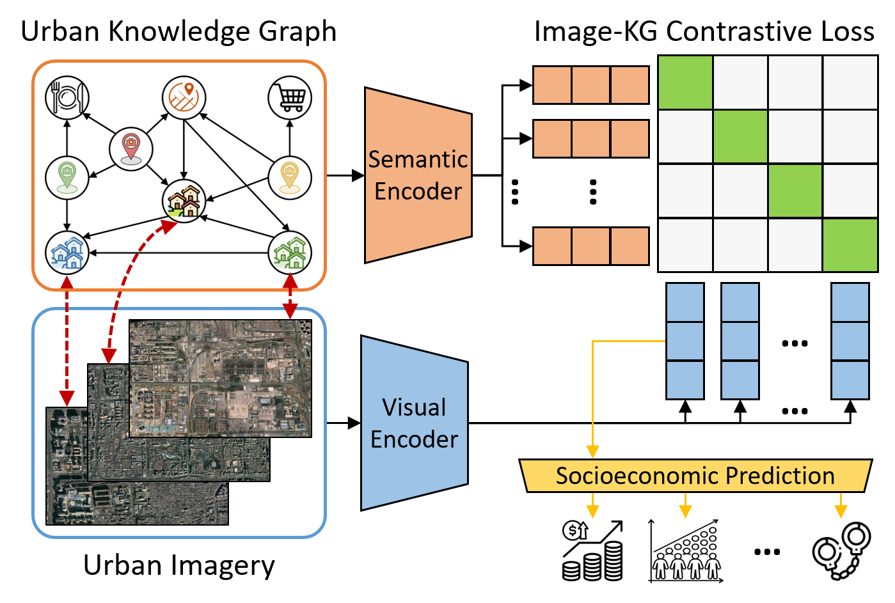

# Knowledge-infused Contrastive Learning for Urban Imagery-based Socioeconomic Prediction

 
 
 ## Dataset 
 Here we provide the dataset of New York for reproducibility, and the image data can be downloaded from [here](https://drive.google.com/drive/folders/1lCc9RR6y2pWSnvKR-JfM8JGnKPXlxOXE?usp=sharing).
 
After downloading the data, copy "zl15_224" into "./data/satellite_image/" folder and copy "Region" into "./data/streetview_image/" folder.
 
 ## Running a model
 To run the contrastive learning model for satellite imagery at Step 1, execute the following command:
  
    CUDA_VISIBLE_DEVICES=0 python main.py --dataset new_york --model_name Pair_CLIP_SI --n_gcn_layer 2 --lr 0.0003 --batch_size 128
                       
 To run the contrastive learning model for street view imagery at Step 1, execute the following command:
  
    CUDA_VISIBLE_DEVICES=0 python main.py --dataset new_york --model_name Pair_CLIP_SV --n_gcn_layer 2 --lr 0.0003 --batch_size 16

To reproduce the population prediction results, execute the following commands:

    CUDA_VISIBLE_DEVICES=0 python mlp.py --indicator pop --dataset new_york --model_name Pair_CLIP_SI --KnowCLgcn 2 --KnowCLlr 0.0003 --KnowCLbatchsize 128 --KnowCLepoch 100 --lr 0.001  --drop_out 0.3 --wd 1.0
    CUDA_VISIBLE_DEVICES=0 python mlp.py --indicator pop --dataset new_york --model_name Pair_CLIP_SV --KnowCLgcn 2 --KnowCLlr 0.0003 --KnowCLbatchsize 16 --KnowCLepoch 100 --lr 0.005  --drop_out 0.1 --wd 0.0

To reproduce the education prediction results, execute the following commands:

    CUDA_VISIBLE_DEVICES=0 python mlp.py --indicator edu --dataset new_york --model_name Pair_CLIP_SI --KnowCLgcn 2 --KnowCLlr 0.0003 --KnowCLbatchsize 128 --KnowCLepoch 100 --lr 0.001  --drop_out 0.3 --wd 1.0
    CUDA_VISIBLE_DEVICES=0 python mlp.py --indicator edu --dataset new_york --model_name Pair_CLIP_SV --KnowCLgcn 2 --KnowCLlr 0.0003 --KnowCLbatchsize 16 --KnowCLepoch 100 --lr 0.001  --drop_out 0.5 --wd 0.1
 
To reproduce the crime prediction results, execute the following commands:

    CUDA_VISIBLE_DEVICES=0 python mlp.py --indicator crime --dataset new_york --model_name Pair_CLIP_SI --KnowCLgcn 2 --KnowCLlr 0.0003 --KnowCLbatchsize 128 --KnowCLepoch 100 --lr 0.0005  --drop_out 0.5 --wd 0.0
    CUDA_VISIBLE_DEVICES=0 python mlp.py --indicator crime --dataset new_york --model_name Pair_CLIP_SV --KnowCLgcn 2 --KnowCLlr 0.0003 --KnowCLbatchsize 16 --KnowCLepoch 100 --lr 0.001 --drop_out 0.1 --wd 0.0

## Requirements
	dgl==1.0.0
	dgl_cu102==0.6.1
	numpy==1.21.6
	pandas==1.3.5
	Pillow==9.4.0
	scikit_learn==1.2.1
	torch==1.9.0+cu111
	torchvision==0.10.0+cu111
	tqdm==4.64.1
	python==3.7.13

## Reference

    @inproceddings{liu2023knowcl,
	title 	  = {Knowledge-infused Contrastive Learning for Urban Imagery-based Socioeconomic Prediction},
	author	  = {Liu, Yu and Zhang, Xin and Ding, Jingtao and Xi, Yanxin and Li, Yong},
	booktitle = {The Web Conference},
	year      = {2023}}
